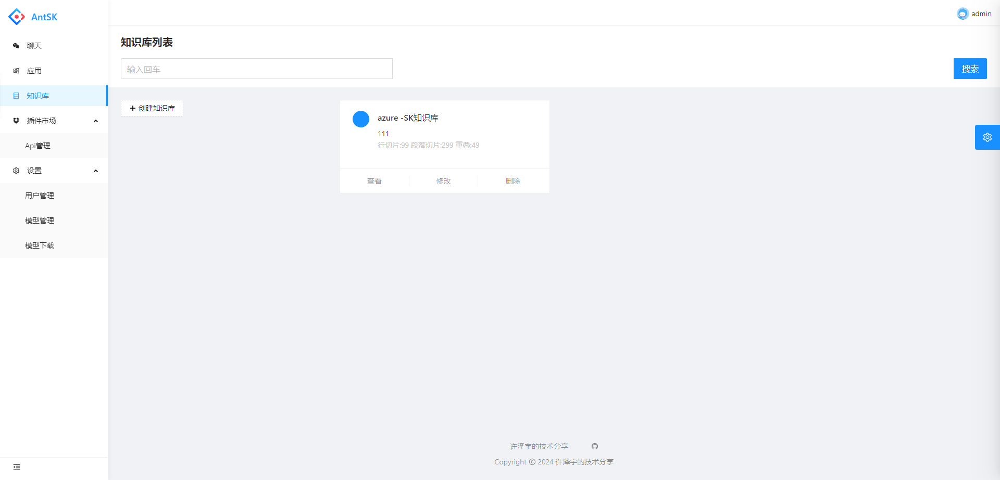
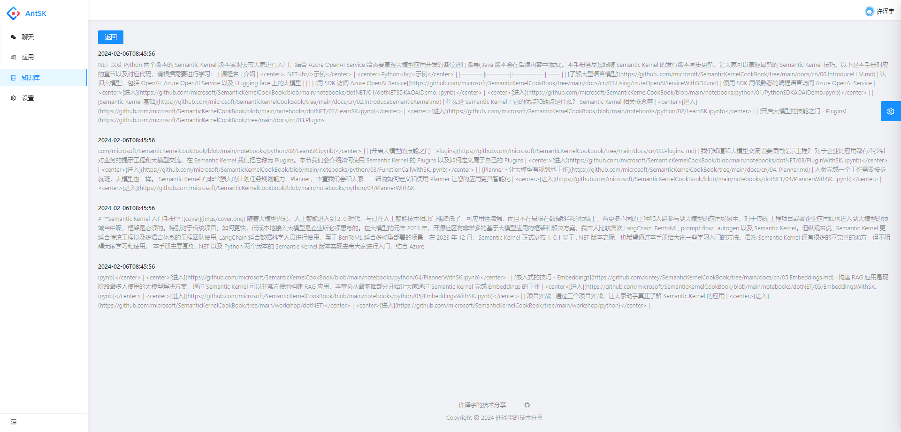
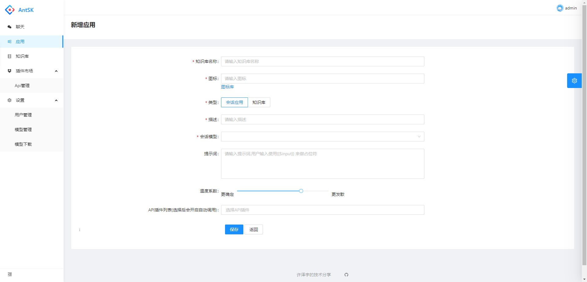
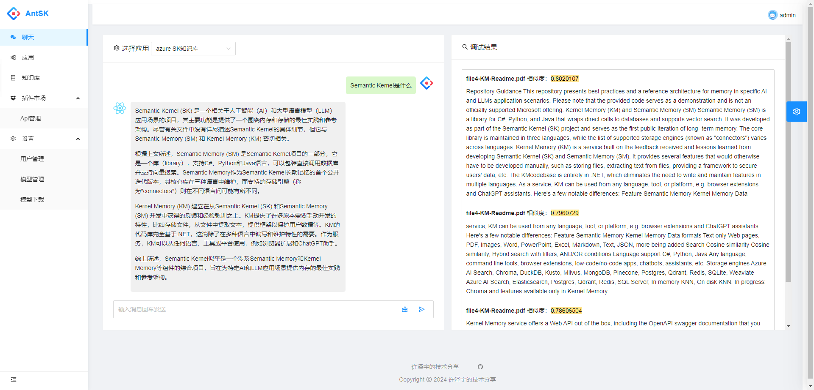

# AntSK功能介绍
## 基于.Net8+AntBlazor+SemanticKernel 打造的AI知识库/智能体

## 核心功能

- **语义内核 (Semantic Kernel)**：采用领先的自然语言处理技术，准确理解、处理和响应复杂的语义查询，为用户提供精确的信息检索和推荐服务。

- **内存内核 (Kernel Memory)**：具备持续学习和存储知识点的能力，AntSK 拥有长期记忆功能，累积经验，提供更个性化的交互体验。

- **知识库**：通过文档（Word、PDF、Excel、Txt、Markdown、Json、PPT）等形式导入知识库，可以进行知识库问答。

- **GPTs 生成**：此平台支持创建个性化的GPT模型，尝试构建您自己的GPT模型。

- **API接口发布**：将内部功能以API的形式对外提供，便于开发者将AntSK 集成进其他应用，增强应用智慧。

- **API插件系统**：开放式API插件系统，允许第三方开发者或服务商轻松将其服务集成到AntSK，不断增强应用功能。

- **.Net插件系统**：开放式dll插件系统，允许第三方开发者或服务商轻松将其业务功能通过标准格式的代码生成dll后集成到AntSK，不断增强应用功能。

- **联网搜索**：AntSK，实时获取最新信息，确保用户接受到的资料总是最及时、最相关的。

- **模型管理**：适配和管理集成不同厂商的不同模型。并且支持**llama.cpp**所支持的gguf类型，以及**llamafactory**所支持的模型离线运行

- **国产信创**：AntSK支持国产模型，和国产数据库，可以在信创条件下运行

- **模型微调**：规划中，基于llamafactory进行模型微调
  

## 应用场景

AntSK 适用于多种业务场景，例如：
- 企业级知识管理系统
- 自动客服与聊天机器人
- 企业级搜索引擎
- 个性化推荐系统
- 智能辅助写作
- 教育与在线学习平台
- 其他有意思的AI App

## 功能示例

[视频示例](https://www.bilibili.com/video/BV1zH4y1h7Y9/)

首先需要创建知识库

在知识库里可以使用文档或者url进行导入

点击查看可以查看知识库的文档切片情况

然后我们需要创建应用，可以创建对话应用和知识库。

知识库应用需要选择已有的知识库，可以选多个

然后再对话中可以对知识库的文档进行提问

另外我们也可以创建对话应用，可以在对应应用中配置提示词模板

下面来看看效果吧

